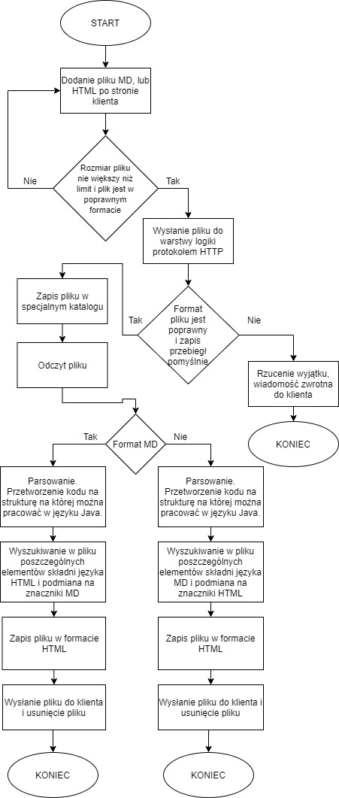

# Podsumowanie etapu 4
## 1. Co zostało zrobione
### 1.1 Poznanie szczegółów formatu Markdown i różnic między nim a formatem HTML

Markdown jest językiem znaczników przeznaczonym do formatowania tekstu. Format użyteczny jest m.in celem lepszej jakości prezentacji projektu na platformie typu GitHub. Główne cechy:
* Formatowanie akapitów - Nowy akapit tworzony jest po przejściu do nowej linii w edytorze, bądź zostawieniu wolnej linii po zastosowaniu znacznika formatującego tekst ( na przykład punkt na liście).
* Nagłówki - tworzone są przy użyciu znaku #. Stanowi to odpowiednik dla znacznika h w kodzie HTML. Przykład:
    ### Odpowiednik h3 ( ### )
    ##### Odpowiednik h5 ( ##### )

* Przerwanie linii - odpowiednikiem znacznika br w HTML jest umieszczenie dwóch spacji na końcu linii.
* Pogrubienie tekstu - Wykonywane za pomocą znaków ** przed ciągiem znaków i na jego końcu. Przykład: **pogrubiony tekst**
* Cytat - Umieszczny za pomocą znaku *. Na przykład: *Tekst italic*
* Listy - Są tworzone, w zależności od potrzeb, jako lista numerowana ( wtedy wystarczy wykonać numerowaną listę jak w edytorze tesktu ), lub punktowana ( należy wstawić znak * przed ciągiem znaków, wykorzystać można też znaki -, + ).
* Bloki kodu - Umieszczane poprzez umieszczenie czterech spacji lub jednego tabulatora. W listach wykorzystać trzeba dwa tabulatory. Przykład: 

        <html>
            <head>
                <title>Test</title>
            </head>
        </html>
* Zdjęcia - tworzone za pomocą konstrukcji ![alternatywny zapis] (url)
* Odnośniki - tworzone za pomocą konstrukcji [tekst przy odnośniku] (url).
 
 ### 1.2 Wstępny schemat blokowy przedstawiający przebieg konwersji
 
 ### 1.3 Zapoznanie się z gotowymi narzędziami ułatwiającymi pracę z zawartością plików
 * Poznanie biblioteki JSoup. Jest ona przydatna przy pobieraniu i pracą nad kodem źródłowym stron w formacie HTML. Ułatwia czynności związane z parsowaniem kodu i wyciąganiem poszczególnych elementów z dokumentu celem modyfikacji.
 ### 1.4 Usprawnienia w kodzie.
 * Dodanie biblioteki JSoup w backendzie.
 * Modyfikacja klienta w zakresie pobierania i wysyłania pliku. Poprawienie zabezpieczeń ( Zły format lub zbyt duży plik ).
## 2. Co wykonam w następnym etapie
* Po lepszym poznaniu narzędzi dopracowany zostanie schemat blokowy.
* Wstepne czynności związane z konwersją między formatem HTML a MD ( otwarcie pliku, próby dokonywania w nich zmian )