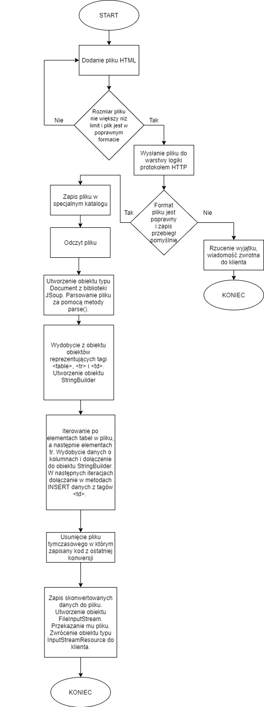
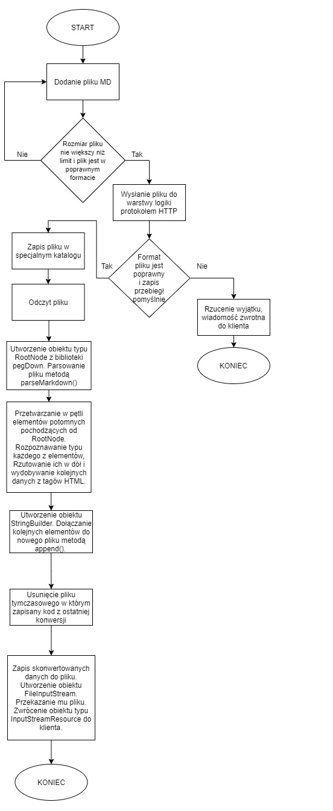

# Podsumowanie etapu 7
## 1. Co zostało zrobione

* Implementacja konwersji pomiędzy formatem HTML a SQL.
    * Konwersja polega na znalezieniu elementów składujących jakieś dane w pliku HTML ( elementy w znacznikach table ) i umieszeniu instrukcji tworzenia tabeli i umieszczenia danych(polecenia CREATE TABLE i INSERT ).
    * Utworzenie nowego serwisu HtmlSqlService zawierającego metodę do konwersji
    * Schemat  blokowy dla konwersji
    
* Ulepszenie schematu blokowego dla konwersji między formatem MD a HTML

* Wyświetlanie wyniku konwersji między HTML a SQL u klienta

## 2. Co wykonam w następnym etapie
* Ulepszenie istniejącej implementacji konwersji z MD na HTML
* Rozwijanie implementacji konwersji HTML na MD i MD na XML
* Poprawa organizacji kodu